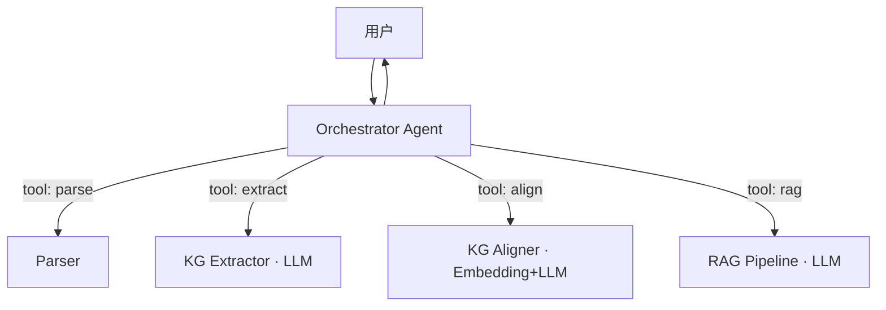

# Agent 架构说明

## a) 架构总览

本系统采用 **单 Agent + 多工具（Tool-using Agent）** 的架构：核心由一个 Orchestrator
负责对用户意图进行路由，并调用一组确定性工具（解析、抽取、对齐、检索）来完成
任务。LLM 仅在"知识抽取"、"等价判定"、"答案生成"三个**真正需要语义理解**的环节被
调用，其余流程使用纯代码以降低 Token 消耗与不确定性。

## b) 设计决策论证

**为什么单 Agent 而非多 Agent？**
- 5 小时极速开发，多 Agent 调度成本（消息总线、状态同步、错误传播）超过其收益。
- 各步骤之间是"明确的流水线"而非"开放式协作"，确定性流程比 Agent 自由编排更稳。
- LLM 调用集中收敛在三个工具内，prompt 复杂度可控，每个 prompt < 2k tokens。

**Prompt 复杂度管理**：
- 按章节切分调用，单次上下文 ≤ 4k 字符。
- 强制 JSON schema + few-shot，使用 `chat_json` 解析失败时降级为空结果。

## c) 数据流与调用链路

见 `docs/系统设计.md`，此处不重复。

## d) 取舍与权衡

- 放弃多 Agent 协作（LangGraph）：节省搭建时间，把工时投入对齐算法与 RAG 评测。
- 放弃 BM25+Rerank（默认）：作为 P1 加分项实现，基线先用纯向量。
- 已知局限：
  - PDF 章节识别仅基于正则，扫描版 PDF 会失败（未来：OCR 兜底）。
  - 对齐阈值固定 0.85，未做学科自适应（未来：构建标注集做阈值搜索）。

## Prompt 防幻觉策略

本系统在多个环节设计了防幻觉措施：

1. **严格 JSON Schema 约束**：Extractor Agent 的 system prompt 明确要求"直接输出JSON，禁止输出解释/寒暄/markdown"，并通过 Pydantic Reflexion 校验闭环自动修正格式错误
2. **知识边界限定**：RAG 生成 prompt 明确规定"严格基于参考资料回答，不允许超出资料知识范围"
3. **未知兜底策略**：无法回答时必须返回"当前知识库中未找到相关信息"，而非编造答案
4. **引用回填验证**：每个回答必须标注来源 [教材名, 章节, 页码]，便于教师交叉核验
5. **LLM 降级保护**：当 LLM 不可用或返回异常时，自动降级为规则推理/本地摘要，不做无根据推断

## 改进路线图

| 优先级 | 问题描述 | 预估工时 | 预期效果 |
|--------|---------|---------|---------|
| P1 | PDF章节识别仅基于正则，扫描版/无标题PDF失败 | 4h | 接入 MinerU 视觉模型做版面分析，覆盖率 60%→95% |
| P1 | 向量检索精度不够（当前哈希降级时） | 2h | 嵌入 BGE-small-zh 真实向量，召回率提升 30%+ |
| P2 | 对齐阈值固定0.55，不同学科最优值不同 | 3h | 引入少量标注样本做阈值自适应，F1提升5-10% |
| P2 | 缺少融合质量评估指标 | 2h | 加 prerequisite 断链检测 + 覆盖率统计面板 |
| P3 | 决策可解释性面板 | 3h | 时间线UI展示每个merge决策的原因+证据 |
| P3 | 教学连贯性自动检查 | 4h | 扫描prerequisite边检测知识断链，给出修复建议 |
