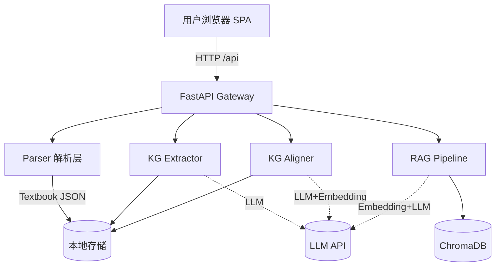

# 系统设计

## 架构图

## 数据流（一次完整流程）

1. 用户在左栏拖拽教材 → `POST /api/upload`
2. 后端 `parser.parse` 输出 `Textbook`，写入 `_TEXTBOOKS`
3. 用户点"抽取" → `POST /api/graph/extract` 按章节并发 LLM 抽取 → 单本图谱
4. 用户点"融合" → `POST /api/graph/merge` 调用 `kg_aligner`：embedding 初筛 + LLM 二筛 → 决策列表 + 融合图谱
5. 用户点"建索引" → `POST /api/rag/index` 分块 + embedding 入 ChromaDB
6. 用户提问 → `POST /api/rag/query` 检索 top-5 → 注入 prompt → LLM 生成 + 引用回填

## 技术选型与理由

| 层 | 选型 | 理由 |
| --- | --- | --- |
| 后端 | FastAPI | 异步原生、Pydantic 自动文档、单文件可起 |
| PDF | PyMuPDF | 速度快、能拿字号做章节启发 |
| 向量库 | ChromaDB | 嵌入式、零运维 |
| Embedding | BGE-small-zh / OpenAI | 中文优化 / 备选 |
| LLM | OpenAI 协议（DeepSeek/通义） | 工具链统一 |
| 前端 | Vue 3 + Vite | 启动快、SFC 简洁 |
| 可视化 | AntV G6 | 力导向 + 交互完善 |
| UI | TailwindCSS | 极速布局 |

## API 一览

详见 README.md「API 一览」表。请求/响应模型见 `backend/models/schemas.py`。
